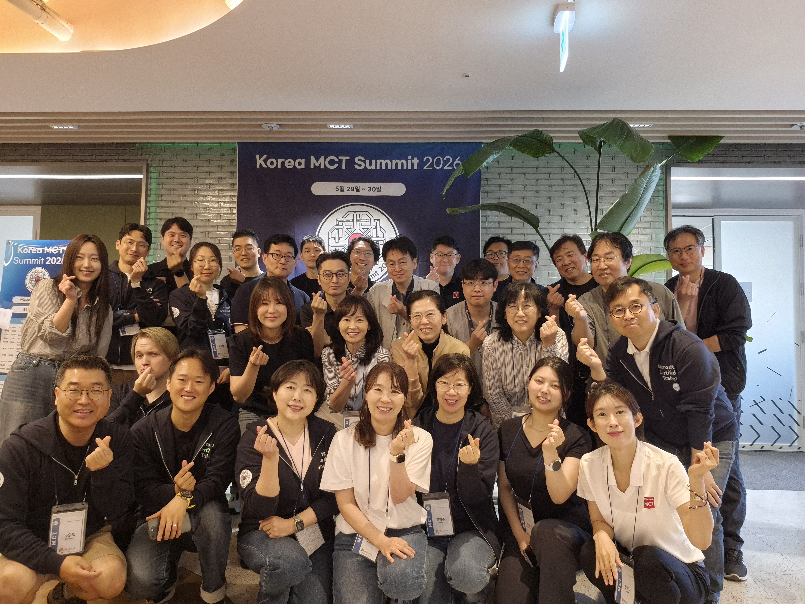
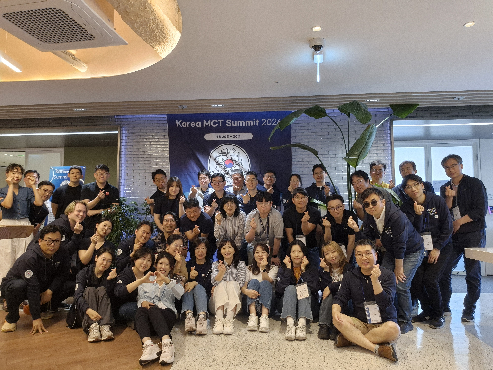
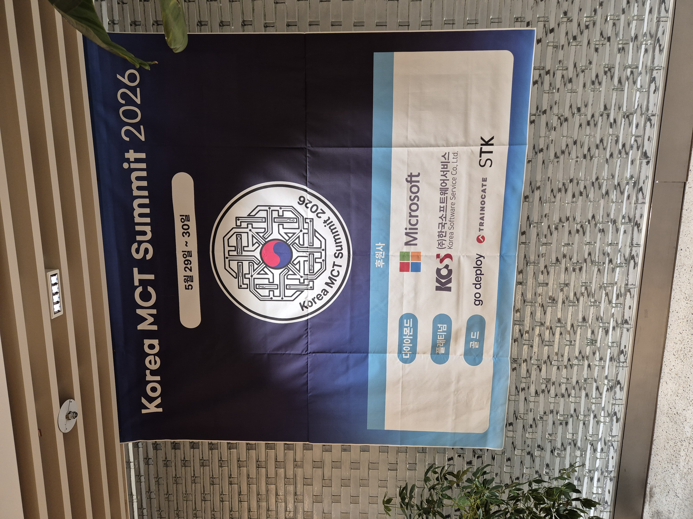
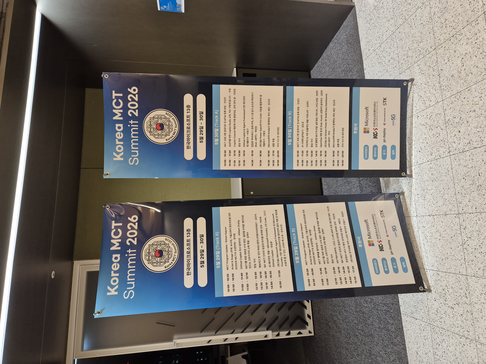

# Korea MCT Summit 2026

Korea MCT Summit 2026, 여러분 덕분에 정말 뜨겁고 행복하게 마무리했습니다.
함께 웃고 배우고 연결됐던 그 순간들을 다시 꺼내볼 수 있도록,
발표자료와 사진, 그리고 행사 요약을 이 저장소에 정리해두었습니다.

행사는 끝났지만 우리 커뮤니티의 배움과 도전은 이제 또 다음 챕터로 이어집니다.

## 행사 마무리 한눈에 보기

- 행사 기간: 2026년 5월 29일(금) ~ 5월 30일(토)
- 장소: 한국마이크로소프트 13층
- 참가 대상: MCT / Alumni / Microsoft 임직원 (사전 등록)
- 참가자: 67명
- 발표자: 24명
- 운영진: 8명
- 후원사(공식 페이지 기준):
	- Diamond: Microsoft
	- Platinum: KOSS
	- Gold: 한국트레이노케이트, go deploy, STK
	- Silver: OpenSG
	- Bronze: 한빛미디어

## 🎉 Korea MCT Summit 2026 종료

Korea MCT Summit 2026이 많은 분들의 도움과 참여 덕분에 성공적으로 마무리되었습니다.
이틀 동안 67명의 참가자와 24명의 발표자,
그리고 8명의 운영진,
후원사와 함께 만들어낸 소중한 여정이었습니다.

소중한 경험을 나눠주신 발표자분들,
함께 배우고 즐겨주신 참가자분들,
그리고 보이지 않는 곳에서 행사를 만들어주신 운영진 여러분께 진심으로 감사드립니다.

여러 방법으로 직접 참여해주신 여러분 덕분에
Korea MCT Summit 2026이 더욱 의미 있는 시간이 될 수 있었습니다. 🙏

다음 온라인 벙개에서 또 즐겁게 만나 뵙겠습니다. 😊
감사합니다.

## 발표자료 바로가기

최신 업데이트 기준 공개 가능한 발표자료 16건을 정리해두었습니다.
못 들은 세션 복습하거나, 다시 보고 싶은 내용 찾아보실 때 편하게 활용해 주세요.

- [발표자료 폴더 바로가기](./share/)

## 대표 행사 사진

메인 사진 외 전체 사진은 아래 폴더에서 확인하실 수 있습니다.

- [photo 폴더 바로가기](./photo/)

## 함께 만든 운영팀

Korea MCT Summit 2026 운영팀
- 안성진
- 진미나
- 전대호
- 윤금재
- 박민진
- 이은주
- 우진환
- 유승호

## 행사 이후에도 함께 이어가요

- 행사 메인 페이지: https://koreamct.github.io./2026/
- 사진 업로드: https://1drv.ms/f/c/2ecff094190d4069/IgDA5Gb48nCgSIHMLfR-j-rJAZDOyN883VG7MdbVLGtz46k?e=pBSYah
- 공식 피드백: https://aka.ms/MCTSummitFeedback
- Korea MCT 피드백: https://forms.office.com/r/xQ3y0LWDNd

이틀간의 일정은 마무리됐지만, 우리 커뮤니티의 성장은 계속됩니다.
다음 자리에서 더 반갑게 만나겠습니다. 고맙습니다.

